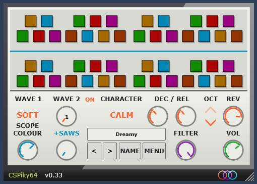

# CS Piky 64

This is an update of a great little 32bit VST2 plugin called [The CS Piky](https://www.dariolupo.com/index.html#shop?vst). It is quite an accurate representation of it too. Maybe some others can get some enjoyment from this nice sounding synth!



## Installation

1. Download or build `CSPiky64.vst3`.
2. Place it in a writable VST3 folder scanned by your plugin host.
3. Rescan VST3 plugins in the host, then load **CSPiky64** as an instrument.

A common system VST3 folder is:

```text
C:\Program Files\Common Files\VST3
```

CSPiky64 stores user data in a `Data` folder beside the plugin. If the chosen VST3 folder is protected by Windows, saving presets, sequencer templates, or settings may require suitable write permission. You can instead use a writable custom VST3 folder configured in your host.

## Using CSPiky64

### Presets

Use the arrow buttons, or scroll over the patch name display, to move through presets one at a time. The **Menu** provides access to factory and user presets, Save, Save As.

The 14 factory presets are embedded in the plugin. User presets are stored as `.ini` files in `Data\Presets`.

## Portable data

CSPiky64 keeps its writable files beside the plugin:

```text
CSPiky64.vst3
Data\
  Settings.ini
  Presets\
```

Keep the `Data` folder with the plugin when moving an existing installation if you want to preserve user presets and interface settings. Missing folders are created when required.

## Building from source

### Requirements

The included build script currently targets **Windows x64** and expects:

- Windows 10 or later
- Visual Studio Community 2026 with the **Desktop development with C++** workload
- CMake 4.4.2
- JUCE 8.0.15
- Windows PowerShell

The versions and locations of CMake and JUCE are fixed in `- Build.bat`. Arrange the folders like this:

```text
Project folder\
  CSPiky64\
    - Build.bat
    source\
  _Tools\
    cmake\
      _4.4.2\
        bin\
          cmake.exe
    JUCE\
      _8.0.15\
        CMakeLists.txt
```

### Build steps

1. Install Visual Studio Community 2026 and its C++ desktop workload.
2. Put CMake 4.4.2 and JUCE 8.0.15 in the locations shown above.
3. Double-click `- Build.bat` in the project root.
4. Wait for all five checks to report `PASS`.
5. Find the finished plugin at `dist\CSPiky64.vst3`.

The script configures an x64 Release build, compiles the VST3, embeds all factory presets, validates the resulting Windows x64 binary, and writes the full build output to `Results.log`. Existing user files in `dist\Data` are preserved, and the script does not install the plugin elsewhere.

> **Note:** The build script closes `PolyHostInterface.exe` if it is running so the existing plugin file is not locked during the build. I added this specifically because thats what I loaded CSPiky64.vst3 in for testing purposes. If you don't use [PolyHostInterface](https://github.com/sl2365/PolyHostInterface), it will just be ignored and compile as normal.

## Credits

- Original CSPiky 32-bit plugin and concept: [Color Space](https://www.dariolupo.com/index.html#shop?vst)
- CSPiky64 64-bit VST3: **sl23**
- Project source and releases on [github](https://github.com/sl2365/CSPiky64)

CSPiky64 is not an exact replica of the original plugin. It is an independent homage created in appreciation of Cosmic Boy's original work. I loved the interface so much, I tried to create a modern version while keeping the originals aesthetics.
